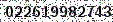

# Impressum

Markus Stubbig  
K&ouml;lner Str 278  
51702 Bergneustadt  
E-Mail   
Tel 

## Inhaltlich Verantwortlicher gem. &sect; 55 II RStV
Markus Stubbig  
K&ouml;lner Str 278  
51702 Bergneustadt  
E-Mail   
Tel 

## Datenschutzerkl&auml;rung

### Geltungsbereich
Diese Datenschutzerkl&auml;rung soll die Nutzer dieser Website gem&auml;&szlig; Bundesdatenschutzgesetz und Telemediengesetz &uuml;ber die Art, den Umfang und den Zweck der Erhebung und Verwendung personenbezogener Daten durch den Websitebetreiber informieren.
Der Websitebetreiber nimmt Ihren Datenschutz sehr ernst und behandelt Ihre personenbezogenen Daten vertraulich und entsprechend der gesetzlichen Vorschriften.
Bedenken Sie, dass die Daten&uuml;bertragung im Internet grunds&auml;tzlich mit Sicherheitsl&uuml;cken bedacht sein kann. Ein vollumf&auml;nglicher Schutz vor dem Zugriff durch Fremde ist nicht realisierbar.

### Zugriffsdaten
Der Websitebetreiber bzw. Seitenprovider erhebt Daten &uuml;ber Zugriffe auf die Seite und speichert diese als „Server-Logfiles“ ab. Welche Daten so protokolliert werden, nennt der Seitenprovider in seinen Erkl&auml;rungen zu [Terms of Service](https://help.github.com/terms-of-service), [Privacy](https://help.github.com/privacy-policy) und [Security](https://help.github.com/security).

### Cookies
Diese Website verwendet Cookies. Dabei handelt es sich um kleine Textdateien, welche auf Ihrem Endger&auml;t gespeichert werden. Ihr Browser greift auf diese Dateien zu. Durch den Einsatz von Cookies erh&ouml;ht sich die Benutzerfreundlichkeit und Sicherheit dieser Website.
G&auml;ngige Browser bieten die Einstellungsoption, Cookies nicht zuzulassen. Hinweis: Es ist nicht gew&auml;hrleistet, dass Sie auf alle Funktionen dieser Website ohne Einschr&auml;nkungen zugreifen k&ouml;nnen, wenn Sie entsprechende Einstellungen vornehmen.

### Umgang mit personenbezogenen Daten
Es ist f&uuml;r die Nutzung unserer Website nicht erforderlich, dass Sie personenbezogene Daten angeben.
Weitergehende personenbezogene Daten werden von uns nur erfasst, wenn Sie diese Angaben freiwillig, etwa im Rahmen einer Anfrage, machen.

### Umgang mit Kontaktdaten
Nehmen Sie mit dem Websitebetreiber durch die angebotenen Kontaktm&ouml;glichkeiten Verbindung auf, werden Ihre Angaben gespeichert, damit auf diese zur Bearbeitung und Beantwortung Ihrer Anfrage zur&uuml;ckgegriffen werden kann. Ohne Ihre Einwilligung werden diese Daten nicht an Dritte weitergegeben.

### Umgang mit Kommentaren und Beitr&auml;gen
Hinterlassen Sie auf dieser Website einen Beitrag oder Kommentar, wird Ihre IP-Adresse gespeichert. Dies dient der Sicherheit des Websitebetreibers: Verst&ouml;&szlig;t Ihr Text gegen das Recht, m&ouml;chte er Ihre Identit&auml;t nachverfolgen k&ouml;nnen.

### Rechte des Nutzers: Auskunft, Berichtigung und L&ouml;schung
Sie als Nutzer erhalten auf Antrag Ihrerseits kostenlose Auskunft dar&uuml;ber, welche personenbezogenen Daten &uuml;ber Sie gespeichert wurden. Sofern Ihr Wunsch nicht mit einer gesetzlichen Pflicht zur Aufbewahrung von Daten (z. B. Vorratsdatenspeicherung) kollidiert, haben Sie ein Anrecht auf Berichtigung falscher Daten und auf die Sperrung oder L&ouml;schung Ihrer personenbezogenen Daten.

### Daten-Erhebung durch die Nutzung von GitHub Pages
Diese Website wird auf Servern von Github Inc., 88 Colin P Kelly Jr St, San Francisco, CA 94107, United States gehostet. Beachten Sie daher auch die GitHub [Privacy Statement](https://help.github.com/privacy-policy).
